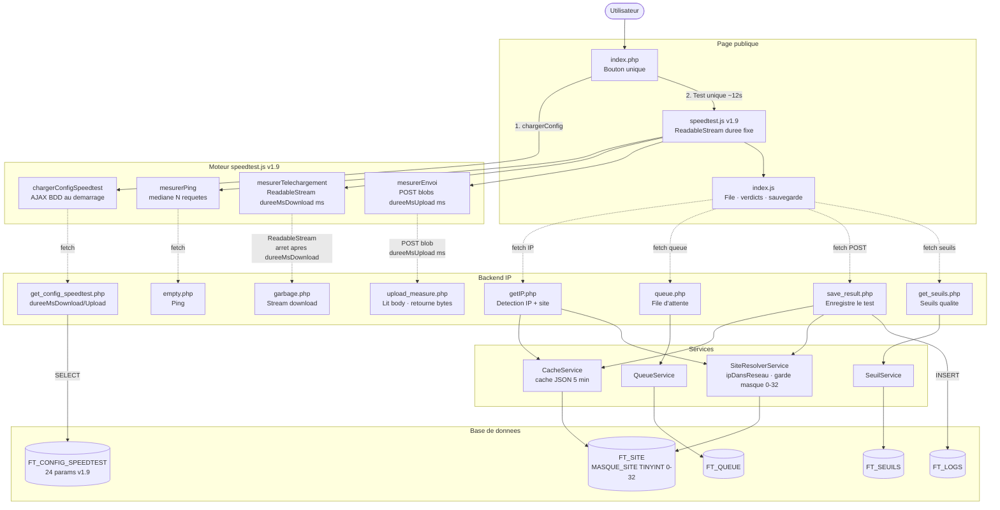
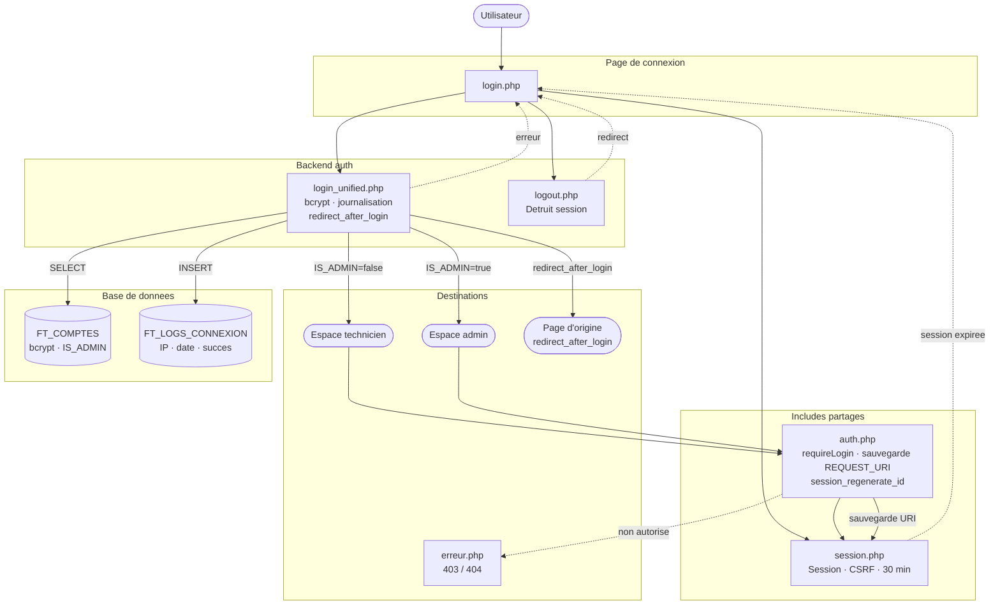
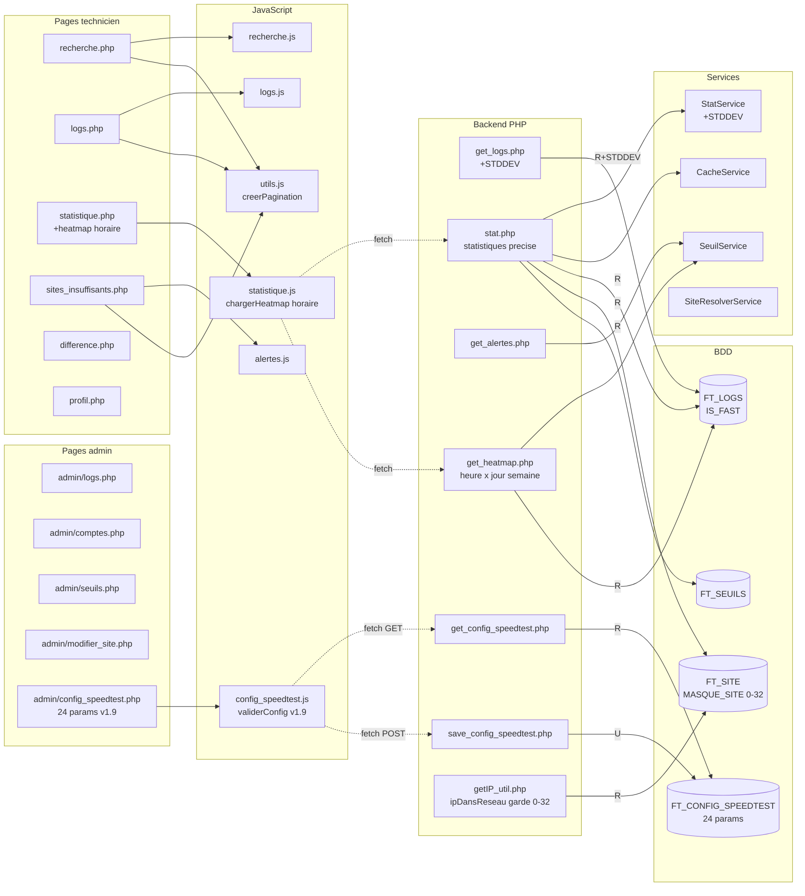
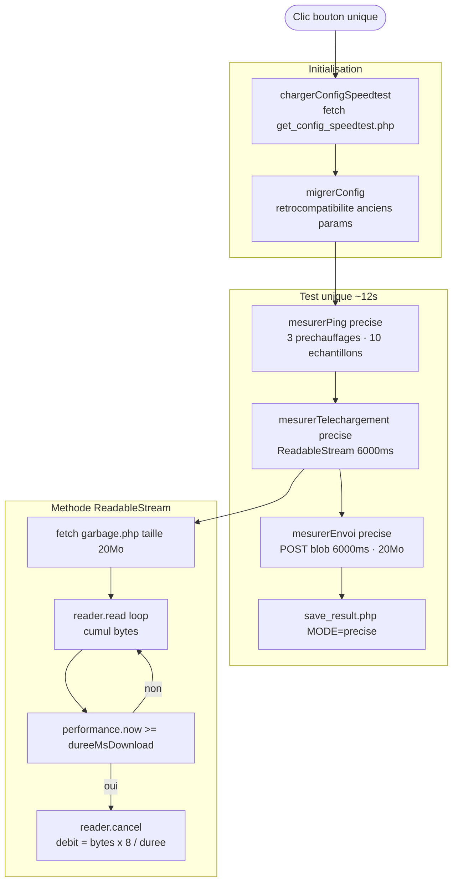

# Ma Connexion — Diagrammes de flux v1.10.0

> Coller chaque bloc de code sur [mermaid.live](https://mermaid.live) pour visualiser.

---

## Diagramme 1 — Flux principal : test de débit (v1.9 — ReadableStream durée fixe)



---

## Diagramme 2 — Authentification et sécurité



---

## Diagramme 3 — Espace technicien et admin



---

## Diagramme 4 — Base de données : tables et relations FK (v1.10.0)

```mermaid
erDiagram
    FT_INTERREGION {
        int ID_INTERREGION PK
        varchar NOM_INTERREGION
    }
    FT_REGION {
        int ID_REGION PK
        varchar NOM_REGION
        int ID_INTERREGION FK
    }
    FT_DEPARTEMENT {
        int ID_DEPARTEMENT PK
        varchar NUM_DEPARTEMENT
        varchar NOM_DEPARTEMENT
        int ID_REGION FK
    }
    FT_SITE {
        varchar CODE_GX_SITE PK
        varchar NOM_SITE
        char CODE_POSTAL
        varchar ADRESSE
        varchar VILLE
        decimal LATITUDE
        decimal LONGITUDE
        tinyint IP_SPECIALE
        varchar IP_RESEAU
        tinyint MASQUE_SITE
        int ID_DEPARTEMENT FK
    }
    FT_LOGS {
        int ID_LOGS PK
        decimal PING_LOGS
        decimal DOWNLOAD_LOGS
        decimal UPLOAD_LOGS
        tinyint IS_FAST  %% colonne legacy v1.9
        datetime DATE_LOGS
        varchar IP_CLIENT
        varchar CODE_GX_SITE FK
    }
    FT_COMMENTAIRES {
        int ID_COMMENTAIRES PK
        datetime DATE_COMMENTAIRE
        varchar CONTENU_COMMENTAIRE
        int ID_LOGS FK
    }
    FT_SEUILS {
        int ID_SEUIL PK
        varchar NOM_SEUIL
        decimal VALEUR_BONNE
        decimal VALEUR_MAUVAISE
    }
    FT_COMPTES {
        int ID_COMPTE PK
        varchar ALIAS_COMPTE
        varchar MDP_COMPTE
        boolean IS_ADMIN
    }
    FT_LOGS_CONNEXION {
        int ID_LOG_CO PK
        int ID_COMPTE FK
        varchar TYPE_ACCES
        varchar IP_CONNEXION
        datetime DATE_CO
        tinyint SUCCES
    }
    FT_QUEUE {
        int ID_QUEUE PK
        varchar TOKEN
        tinyint ID_STATUS FK
        datetime CREATED_AT
        datetime STARTED_AT
    }
    FT_QUEUE_STATUS {
        tinyint ID_STATUS PK
        varchar NOM_STATUS
    }
    FT_QUEUE_LOCK {
        int ID PK
    }
    FT_CONFIG_SPEEDTEST {
        varchar CLE_CONFIG PK
        decimal VALEUR_CONFIG
        varchar LIBELLE
        varchar UNITE
        datetime DATE_MAJ
    }
    FT_AUDIT_SITES {
        int ID_AUDIT PK
        int ID_COMPTE FK
        varchar ACTION
        varchar ID_SITE
        varchar NOM_SITE
        datetime DATE_ACTION
        varchar IP_ACTION
        json DETAIL
    }
    FT_SEUILS_SITE {
        int ID_SEUIL_SITE PK
        varchar CODE_GX_SITE FK
        decimal DL_BON
        decimal DL_MAUVAIS
        decimal UL_BON
        decimal UL_MAUVAIS
        decimal PING_BON
        decimal PING_MAUVAIS
        varchar RAISON
        datetime DATE_MAJ
        int MAJ_PAR FK
    }

    FT_INTERREGION ||--o{ FT_REGION : "1 vers N"
    FT_REGION ||--o{ FT_DEPARTEMENT : "1 vers N"
    FT_DEPARTEMENT ||--o{ FT_SITE : "1 vers N"
    FT_SITE ||--o{ FT_LOGS : "1 vers N"
    FT_LOGS ||--o| FT_COMMENTAIRES : "1 vers 0/1"
    FT_COMPTES ||--o{ FT_LOGS_CONNEXION : "1 vers N"
    FT_QUEUE_STATUS ||--o{ FT_QUEUE : "1 vers N"
    FT_COMPTES ||--o{ FT_AUDIT_SITES : "1 vers N"
    FT_SITE ||--o{ FT_SEUILS_SITE : "1 vers 0/N"
    FT_COMPTES ||--o{ FT_SEUILS_SITE : "MAJ_PAR"
```

---

## Diagramme 5 — Moteur speedtest.js v1.10 — Test unique précis (~12s)


